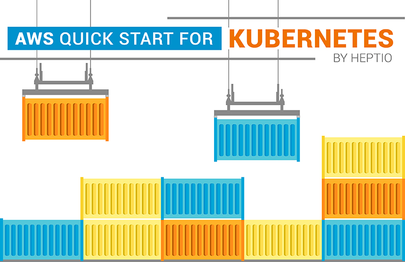

# AWS Quickstart to Create Kubeadm Single master node and with 2 worker nodes.  

Amazon's page for this is [here][amazon].

## Deploy Kubeadm Kubernetes cluster in an existing AWS VPC.

The deploy this Quick Start CloudFormation template "CloudFormation-template-for-Kubeadm-1-master-2-worker-nodes.yaml" on AWS
"into an existing VPC".

With this CloudFormation template you can deploy any version of Kubernetes on an ubuntu 18.04 LTS version.
This CloudFormation template will create single master node and 2 worker nodes of same version of Kubernetes version specified
during CloudFormation template deployment. Default version of Kubernetes i.e 1.21.0.

# Set an environment variable to tell kubectl where to find this file

Kubeconfig file is be created in the master node of the cluster under ubuntu user, ssh into the master node to access Kubernetes cluster that is deployed.

This CloudFormation template can be edited and modified. Changes are welcome.

## Purpose Of CloudFormation template:

To test out Kubeadm Kubernetes, in order to compare with Cloud Based Kubernetes cluster. If you have to investigate difference between a simple Kubeadm cluster and a Cloud Based Kubernetes cluster.

## Thanks to Heptio VMware AWS Quickstart.

https://github.com/aws-quickstart/quickstart-vmware

Which was use as based to this project.
